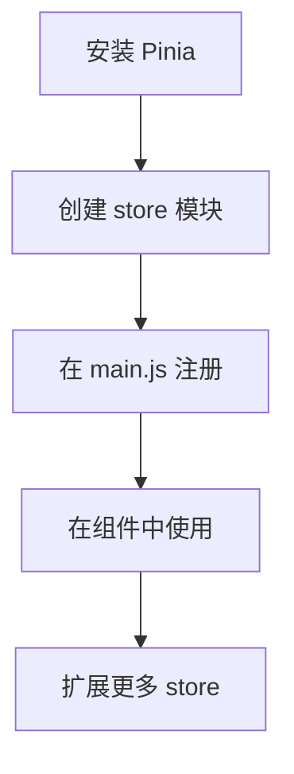

非常好！你使用的是 **Vue 3 + pnpm**，项目尚未实现状态管理，正处在配置阶段——这是引入 **Pinia** 的最佳时机！

> ✅ **推荐方案：使用 Pinia 作为 Vue 3 的状态管理工具（官方推荐）**
>
> ❌ 不建议使用 Vuex（已进入维护模式），尤其在新项目中。

---

## 🚀 一、为什么选择 Pinia？

| 特性                           | Pinia                   | Vuex                   |
| ------------------------------ | ----------------------- | ---------------------- |
| 是否支持 Vue 3 Composition API | ✅ 完美支持             | ⚠️ 需配合 `useStore()` |
| 类型支持（TS）                 | ✅ 极佳                 | ⚠️ 较弱                |
| 多 store 支持                  | ✅ 每个模块独立         | ❌ 单一 store          |
| 代码简洁度                     | ✅ 更简洁易读           | ❌ 模块化复杂          |
| 官方推荐                       | ✅ 是（Vue 3 官方推荐） | ❌ 已不主推            |
| 与 pnpm 兼容                   | ✅ 完全兼容             | ✅ 兼容                |

👉 **结论：对于你的 Vue 3 + pnpm 项目，Pinia 是最自然、最高效的选择。**

---

## 🧱 二、如何用 pnpm 在 Vue 3 项目中配置 Pinia？（完整步骤）

### ✅ 步骤 1：安装 Pinia

```bash
pnpm add pinia
```

> ✅ 使用 `pnpm` 安装，会自动处理依赖树，避免冗余包。

---

### ✅ 步骤 2：创建 `src/stores/` 目录并初始化

```bash
mkdir -p src/stores
touch src/stores/index.js
touch src/stores/app.js
```

#### 文件结构如下

```bash
src/
├── stores/
│   ├── index.js          # 创建并导出全局 store 实例
│   └── app.js            # 应用级状态（如菜单折叠）
├── main.js               # 入口文件
└── App.vue
```

---

### ✅ 步骤 3：创建 `src/stores/app.js`（第一个 store）

```js
// src/stores/app.js
import { defineStore } from 'pinia'

export const useAppStore = defineStore('app', {
  state: () => ({
    isSidebarCollapse: false, // 菜单折叠状态
    theme: 'light', // 主题模式
    language: 'zh', // 语言
  }),

  actions: {
    toggleSidebar() {
      this.isSidebarCollapse = !this.isSidebarCollapse
    },
    setTheme(theme) {
      this.theme = theme
    },
  },

  getters: {
    sidebarWidth: (state) => (state.isSidebarCollapse ? 63 : 200),
  },
})
```

> 💡 `defineStore('app', {...})` 中的 `'app'` 是 store 的唯一 ID，用于识别。

---

### ✅ 步骤 4：创建 `src/stores/index.js`（注册所有 store）

```js
// src/stores/index.js
import { createPinia } from 'pinia'
import { useAppStore } from './app'

// 创建 Pinia 实例
const pinia = createPinia()

// 可选：导出 store 实例供其他模块使用
export default pinia

// 或者直接导出 store（可选）
export { useAppStore }
```

---

### ✅ 步骤 5：在 `main.js` 中注册 Pinia

```js
// main.js
import { createApp } from 'vue'
import App from './App.vue'
import pinia from './stores' // 导入 Pinia 实例

const app = createApp(App)
app.use(pinia) // 注册 Pinia
app.mount('#app')
```

> ✅ 这样就完成了全局状态管理的初始化！

---

### ✅ 步骤 6：在组件中使用状态

```vue
<!-- Layout.vue -->
<script setup>
import { useAppStore } from '@/stores/app'
import { storeToRefs } from 'pinia'

const appStore = useAppStore()
const { isSidebarCollapse, theme } = storeToRefs(appStore)

// 方法调用
const toggleSidebar = () => {
  appStore.toggleSidebar()
}
</script>

<template>
  <div class="layout">
    <aside :class="{ collapsed: isSidebarCollapse }">...</aside>
    <button @click="toggleSidebar()">
      {{ isSidebarCollapse ? '展开' : '折叠' }}
    </button>
  </div>
</template>
```

> 🔍 `storeToRefs()` 可以将响应式 state 解构为响应式 ref，避免丢失响应性。

---

## 📦 三、后续扩展建议（按需添加）

### 1. 用户状态管理（`user.js`）

```js
// src/stores/user.js
export const useUserStore = defineStore('user', {
  state: () => ({
    userInfo: null,
    token: '',
    isLoggedIn: false,
  }),

  actions: {
    login(userData) {
      this.userInfo = userData
      this.token = userData.token
      this.isLoggedIn = true
    },
    logout() {
      this.userInfo = null
      this.token = ''
      this.isLoggedIn = false
    },
  },
})
```

### 2. 数据缓存管理（`data.js`）

```js
// src/stores/data.js
export const useDataStore = defineStore('data', {
  state: () => ({
    weather: null,
    news: [],
    loading: false,
  }),

  actions: {
    async fetchWeather(city) {
      this.loading = true
      try {
        const res = await fetch(`/api/weather?city=${city}`)
        this.weather = await res.json()
      } finally {
        this.loading = false
      }
    },
  },
})
```

---

## 🔄 四、如何在 pnpm 项目中组织代码？

| 目录                  | 说明                     |
| --------------------- | ------------------------ |
| `src/stores/`         | 所有 store 模块存放处    |
| `src/stores/index.js` | 创建并导出 `pinia` 实例  |
| `src/main.js`         | 注册 `pinia` 到 Vue 应用 |
| `src/components/`     | UI 组件                  |
| `src/views/`          | 页面视图组件             |

> ✅ 推荐使用 `pnpm` 的工作区功能（如果你有多个包），但当前单项目无需特殊配置。

---

## 🛠️ 五、常见问题解答（FAQ）

### Q1：Pinia 和 Vuex 有什么区别？

- **Pinia** 更轻量、API 简洁、支持 TypeScript 更好。
- **Vuex** 结构更复杂，适合大型项目，但学习成本高。

### Q2：是否需要 TypeScript？

- 不需要！Pinia 完全支持 JS 项目。
- 你可以先用 JS，未来升级 TS 也无障碍。

### Q3：如何持久化状态？

- 使用 `localStorage` 手动保存：

  ```js
  const saveState = () => {
    localStorage.setItem(
      'app-state',
      JSON.stringify({
        isSidebarCollapse: this.isSidebarCollapse,
        theme: this.theme,
      }),
    )
  }
  ```

- 或使用插件：`pinia-plugin-persistedstate`

### Q4：是否支持异步操作？

- ✅ 支持！`actions` 可返回 Promise，或使用 `async/await`。

---

## ✅ 总结：Pinia 全局状态管理配置流程



> ✅ 你现在可以开始从 `app.js` 开始，逐步构建你的状态管理体系。

---

## 🎯 下一步建议

1. ✅ 先实现 `useAppStore` 管理菜单折叠状态
2. ✅ 在侧边栏和头部绑定 `isSidebarCollapse`
3. ✅ 添加 `dark mode` 支持（主题切换）
4. ✅ 后续再接入用户登录、数据缓存等模块

---

如果你希望我帮你生成完整的 `useAppStore` + `main.js` + `Layout.vue` 示例代码，我可以继续提供。欢迎随时提问！
